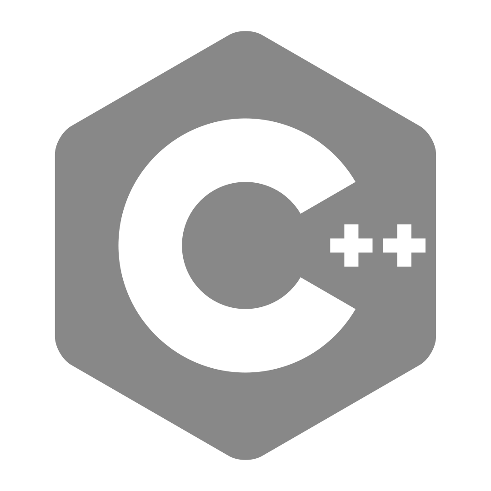
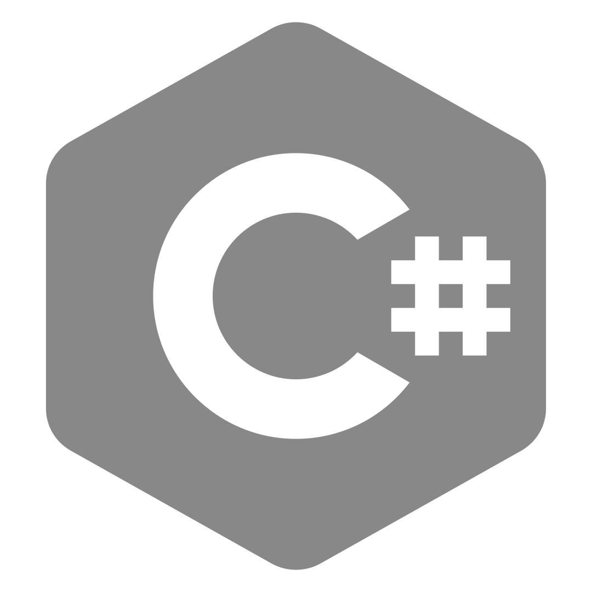
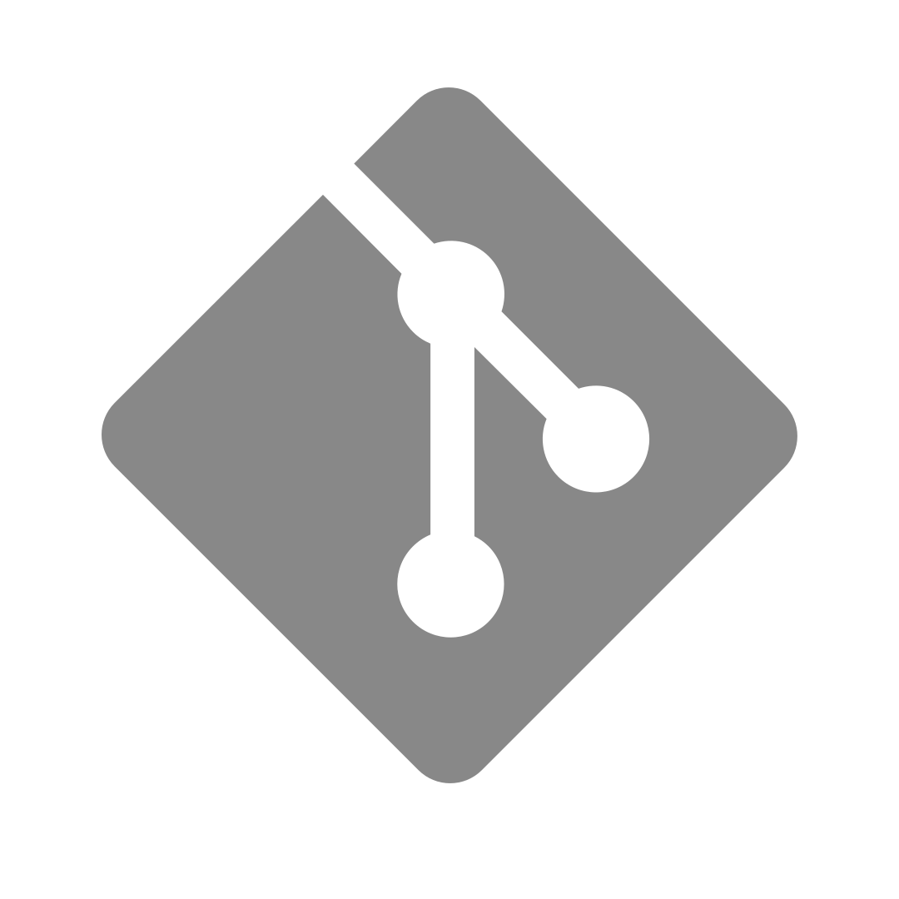
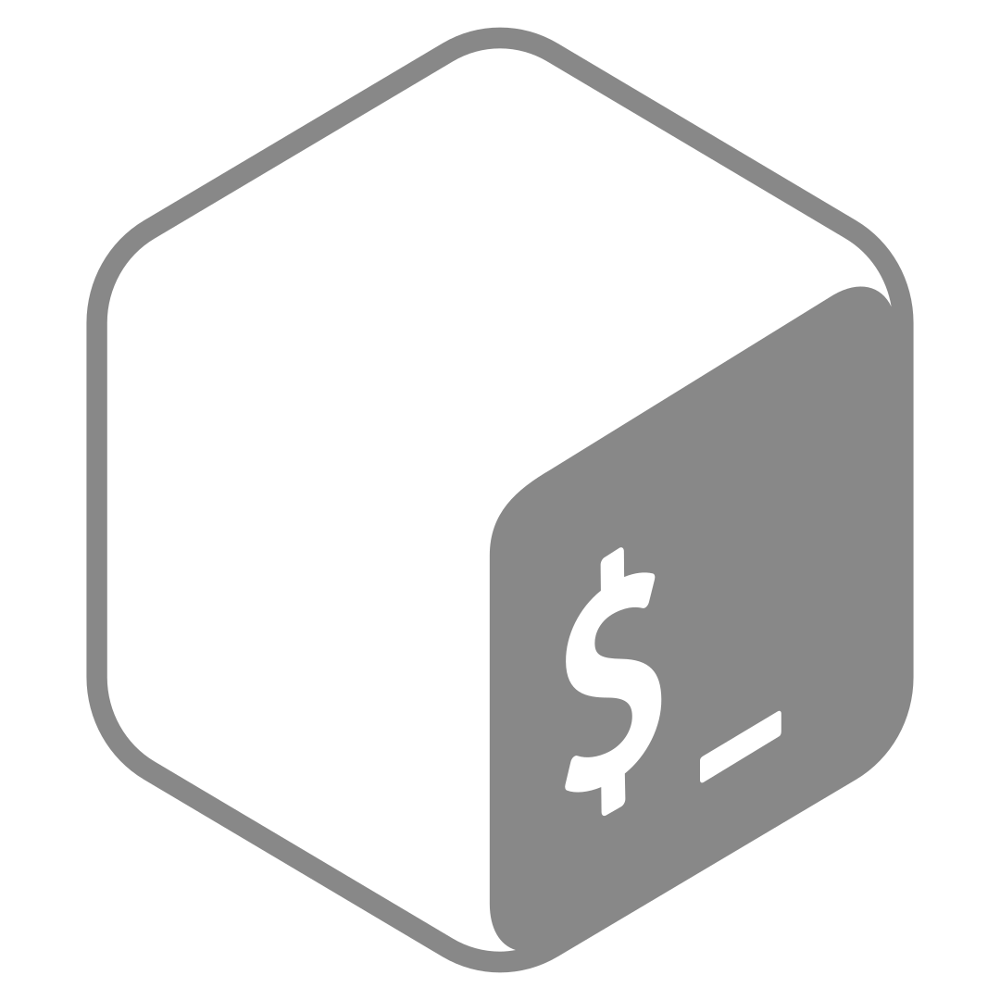
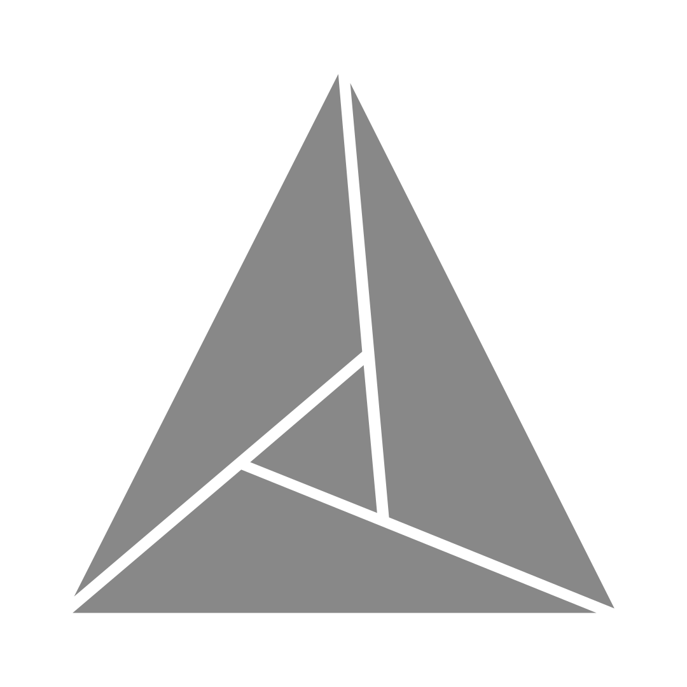
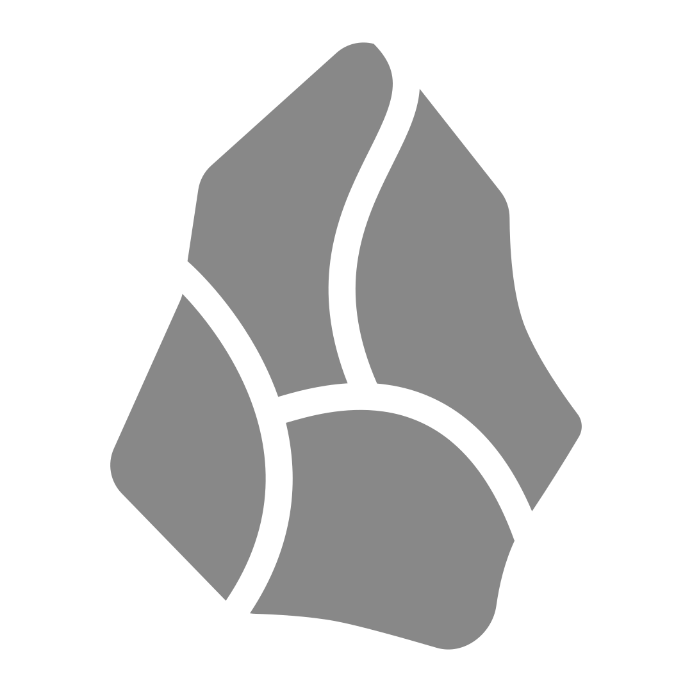

   Hi, here you'll find <b>games</b>, <b>visualisations</b>, <b>simulations</b>, and <b>tools</b> that I've made. 
   <b>Languages</b> 
    
    
    
   <b>Frameworks and Tools</b> 
    
    
    
    
    
   <b>Software</b> 
    
    
    
    
  <h6>Click a tool or software for more info</h6>

